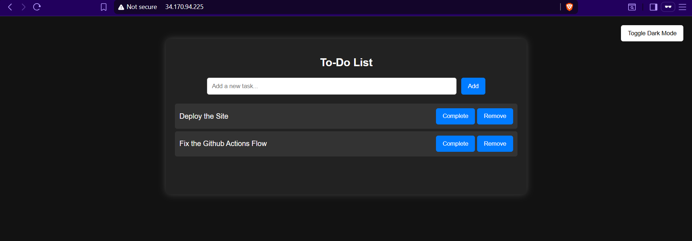

# Ansible Flask Web App Deployment with Monitoring

## 📚 Overview

This project automates the deployment of a Flask-based To-Do web application on GCP VM instances using **Ansible**.
It includes roles for system hardening, user creation, web server setup, and monitoring with Node Exporter.

The architecture ensures consistent configuration, security best practices, and monitoring support — all through Ansible automation.

---

## 🧩 Roles Breakdown

### 1️⃣ users

* Creates a dedicated `devops` user for deployment instead of using the default `root` user.
* Adds the `devops` user to the sudo group for administrative tasks.
* Disables root password-based SSH to enforce key-based authentication for improved security.

### 2️⃣ security

* Ensures SSH password login is disabled.
* Applies essential system security configurations (e.g., disables root login, ensures sudo permissions, and locks down unnecessary access).
* Skips UFW for GCP VMs, as firewall rules are handled via GCP network settings.

### 3️⃣ webserver

* Installs and configures **Nginx**, **Python3**, and **Gunicorn**.
* Deploys the Flask To-Do app from a GitHub repository.
* Configures Nginx as a reverse proxy to serve the Flask app via Gunicorn.
* Creates a systemd service to ensure the Flask app automatically starts on boot.

### 4️⃣ monitoring

* Deploys **Node Exporter** to expose system metrics for Prometheus.
* Runs Node Exporter as a background service managed by systemd.
* Enables monitoring for CPU, memory, and disk usage.

---

## ⚙️ Playbooks

### `bootstrap.yaml`

Used for initial setup:

* Creates `devops` user.
* Copies SSH keys.
* Prepares the system for Ansible connection.

### `playbook.yaml`

Main deployment playbook:

* Runs all roles (`security`, `webserver`, `monitoring`) sequentially to set up the full stack.

---

## 🧱 Directory Structure

```
.
├── ansible.cfg
├── bootstrap.yaml
├── inventory.ini
├── playbook.yaml
├── roles/
│   ├── users/
│   ├── security/
│   ├── webserver/
│   └── monitoring/
├── assets/
│   ├── website.png
│   └── output.png
```

---

## 🔑 SSH Key Setup

1. Generate a new SSH key pair on your control node:

```bash
ssh-keygen -t rsa -b 4096 -f ~/.ssh/id_rsa_ansible
```

2. Add the public key to the VM’s `authorized_keys` for the deployment user:

```bash
ssh-copy-id -i ~/.ssh/id_rsa_ansible devops@<vm-ip>
```

3. Test SSH connection:

```bash
ssh -i ~/.ssh/id_rsa_ansible devops@<vm-ip>
```

4. Update your inventory to use this key:

```ini
[web]
<vm-ip> ansible_user=devops ansible_ssh_private_key_file=~/.ssh/id_rsa_ansible
```

---

## 🚀 How to Use

1. **Update inventory**

```bash
[web]
<your-server-ip> ansible_user=devops ansible_ssh_private_key_file=~/.ssh/id_rsa_ansible
```

2. **Run bootstrap playbook**

```bash
ansible-playbook -i inventory.ini bootstrap.yaml
```

3. **Run main playbook**

```bash
ansible-playbook -i inventory.ini playbook.yaml
```

4. **Access the app**
   Visit: `http://<your-server-ip>`

---

## 📊 Monitoring

Once deployed, Node Exporter exposes metrics at:
`http://<your-server-ip>:9100/metrics`

You can integrate this with Prometheus for real-time system monitoring.

---

## 🛡️ Security Practices

* SSH password authentication disabled.
* Dedicated user for deployments.
* Key-based SSH for secure access.

---

## 🖼️ Assets / Output

**Deployed Website Screenshot**


**CLI Output of Playbook**


---

## 🧠 Future Enhancements

* Add Prometheus & Grafana deployment for visual monitoring.
* Integrate CI/CD using GitHub Actions.
* Extend Flask app with MySQL database support.
